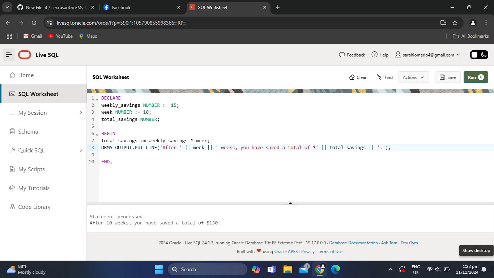

# Module 2: Writing Sample PL/SQL Programs

#My code
DECLARE
weekly_savings NUMBER := 15;
week NUMBER := 10;
total_savings NUMBER;

BEGIN
total_savings := weekly_savings * week;
DBMS_OUTPUT.PUT_LINE('After ' || week || ' weeks, you have saved a total of $' || total_savings || '.');

END;

#What I learned
In this module, I learned how to write PL/SQL programs that can add, update and show the information.

# Challenge Questions Answer:
- To modify the code if my weekly savings amount changed, I would change the value assigned to the  weekly_savings  variable.
- To add a bonus, add a new variable for the bonus amount and add it to  total_savings  before the output.

# Code Output

